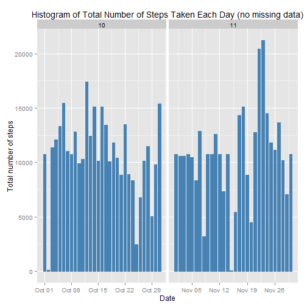

This assignment is part of the Coursera Reproducible Research Module of Data Science. 

This assignment makes use of data from a personal activity monitoring device. This device collects data at 5 minute intervals through out the day. The data consists of two months of data from an anonymous individual collected during the months of October and November, 2012 and include the number of steps taken in 5 minute intervals each day.

The data is contained in the course web site  

## Loading and preprocessing the data

Lets set the working directory and data ready

```r
echo = TRUE  # Always make code visible
options(scipen = 1)  # Turn off scientific notations for number

## Set working directory
unzip("activity.zip")
data <- read.csv("activity.csv", colClasses = c("integer", "Date", "factor"))
data$month <- as.numeric(format(data$date, "%m"))
noNA <- na.omit(data)
rownames(noNA) <- 1:nrow(noNA)
head(noNA)
```

```
##   steps       date interval month
## 1     0 2012-10-02        0    10
## 2     0 2012-10-02        5    10
## 3     0 2012-10-02       10    10
## 4     0 2012-10-02       15    10
## 5     0 2012-10-02       20    10
## 6     0 2012-10-02       25    10
```

```r
## Process & format data suitable for analysis
dim(noNA)
```

```
## [1] 15264     4
```

```r
## Plot a histogram of the total number of steps taken each day

library(ggplot2)
```

```
## Warning: package 'ggplot2' was built under R version 3.2.2
```

```r
ggplot(noNA, aes(date, steps)) + geom_bar(stat = "identity", colour = "steelblue", fill = "steelblue", width = 0.7) 
```

 
## What is mean total number of steps taken per day?
Calculate and showing the ***total number of steps taken per day***

```r
## Calculate and report the mean and median of the total number of steps taken per day
totalSteps <- aggregate(noNA$steps, list(Date = noNA$date), FUN = "sum")$x
mean(totalSteps)
```

```
## [1] 10766.19
```

```r
median(totalSteps)
```

```
## [1] 10765
```
## What is the average daily activity pattern?
For this question we will disregard the NA's by removing them from the data frame. 

```r
## show the average daily activity pattern
avgSteps <- aggregate(noNA$steps, list(interval = as.numeric(as.character(noNA$interval))), FUN = "mean")
names(avgSteps)[2] <- "meanOfSteps"
ggplot(avgSteps, aes(interval, meanOfSteps)) + geom_line(color = "steelblue", size = 0.8) + labs(title = "Time Series Plot of the 5-minute Interval", x = "5-minute intervals", y = "Average Number of Steps Taken")
```

 


## Imputing missing values

```r
# Calculate and report the total number of missing values in the dataset (i.e. the total number of rows with NAs)
sum(is.na(data))
```

```
## [1] 2304
```

Devise a strategy for filling in all of the missing values in the dataset using mean/median for that day, or the mean for that 5-minute interval, etc.

```r
## Create a new dataset that is equal to the original dataset but with the missing data filled in.
newData <- data 
for (i in 1:nrow(newData)) {
    if (is.na(newData$steps[i])) {
        newData$steps[i] <- avgSteps[which(newData$interval[i] == avgSteps$interval), ]$meanOfSteps
    }
}
head(newData)
```

```
##       steps       date interval month
## 1 1.7169811 2012-10-01        0    10
## 2 0.3396226 2012-10-01        5    10
## 3 0.1320755 2012-10-01       10    10
## 4 0.1509434 2012-10-01       15    10
## 5 0.0754717 2012-10-01       20    10
## 6 2.0943396 2012-10-01       25    10
```

```r
## check if any missing data
sum(is.na(newData))
```

```
## [1] 0
```
# Plot a histogram of the total number of steps taken each day 
A histogram plots the frequency of a variable. In our case we want to plot a histogram of the total number of steps per day. 

We use the output of **ggplot()** to plot the result.


```r
ggplot(newData, aes(date, steps)) + geom_bar(stat = "identity",
                                             colour = "steelblue",
                                             fill = "steelblue",
                                             width = 0.7) + facet_grid(. ~ month, scales = "free") + labs(title = "Histogram of Total Number of Steps Taken Each Day (no missing data)", x = "Date", y = "Total number of steps")
```

 
## Are there differences in activity patterns between weekdays and weekends?
Calculate and report the new mean and median total number of steps taken per day. 

```r
newTotalSteps <- aggregate(newData$steps, 
                           list(Date = newData$date), 
                           FUN = "sum")$x
newMean <- mean(newTotalSteps)
newMean
```

```
## [1] 10766.19
```

```r
newMedian <- median(newTotalSteps)
newMedian
```

```
## [1] 10766.19
```

```r
oldMean <- mean(totalSteps)
oldMedian <- median(totalSteps)

newMean - oldMean
```

```
## [1] 0
```

```r
newMedian - oldMedian
```

```
## [1] 1.188679
```

```r
head(newData)
```

```
##       steps       date interval month
## 1 1.7169811 2012-10-01        0    10
## 2 0.3396226 2012-10-01        5    10
## 3 0.1320755 2012-10-01       10    10
## 4 0.1509434 2012-10-01       15    10
## 5 0.0754717 2012-10-01       20    10
## 6 2.0943396 2012-10-01       25    10
```

```r
# using weekdays() function

newData$weekdays <- factor(format(newData$date, "%A"))
levels(newData$weekdays)
```

```
## [1] "Friday"    "Monday"    "Saturday"  "Sunday"    "Thursday"  "Tuesday"  
## [7] "Wednesday"
```

```r
table(newData$weekdays)
```

```
## 
##    Friday    Monday  Saturday    Sunday  Thursday   Tuesday Wednesday 
##      2592      2592      2304      2304      2592      2592      2592
```

```r
levels(newData$weekdays) <- list(weekday = c("Monday", "Tuesday",
                                             "Wednesday", 
                                             "Thursday", "Friday"),
                                 weekend = c("Saturday", "Sunday"))
levels(newData$weekdays)
```

```
## [1] "weekday" "weekend"
```

```r
table(newData$weekdays)
```

```
## 
## weekday weekend 
##   12960    4608
```

```r
## check What is the impact of imputing missing data on the estimates of the total daily number of steps?
## Check if there differences in activity patterns between weekdays and weekends?

## Create a new factor variable in the dataset with two levels - "weekday" and "weekend" indicating whether a given date is a weekday or weekend day.

avgSteps <- aggregate(newData$steps, 
                      list(interval = as.numeric(as.character(newData$interval)), 
                           weekdays = newData$weekdays),
                      FUN = "mean")
names(avgSteps)[3] <- "meanOfSteps"

library(lattice)
```
Ploat a panel with time series plot (i.e. type = "l") of the 5-minute interval (x-axis) and the average number of steps taken, averaged across all weekday days or weekend days (y-axis). 

Based on the graphs above there is a clear difference in activity between weekday and weekend   
1. The number of steps is higher at the busiest interval   
2. The peaks are better defined during the weekday  

```r
xyplot(avgSteps$meanOfSteps ~ avgSteps$interval | avgSteps$weekdays, 
       layout = c(1, 2), type = "l", 
       xlab = "Interval", ylab = "Number of steps")
```

 
 
